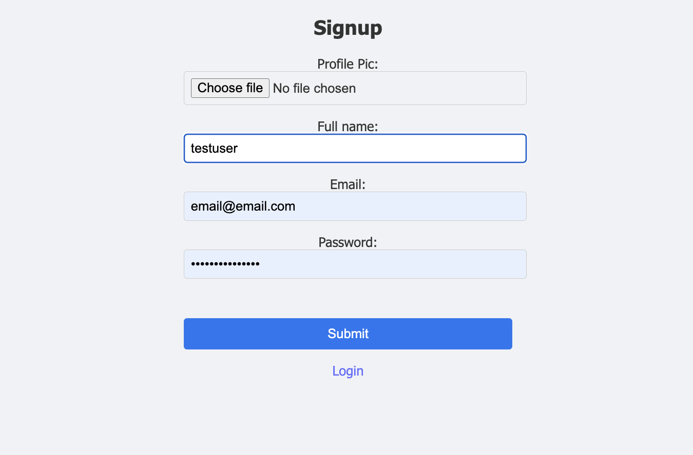
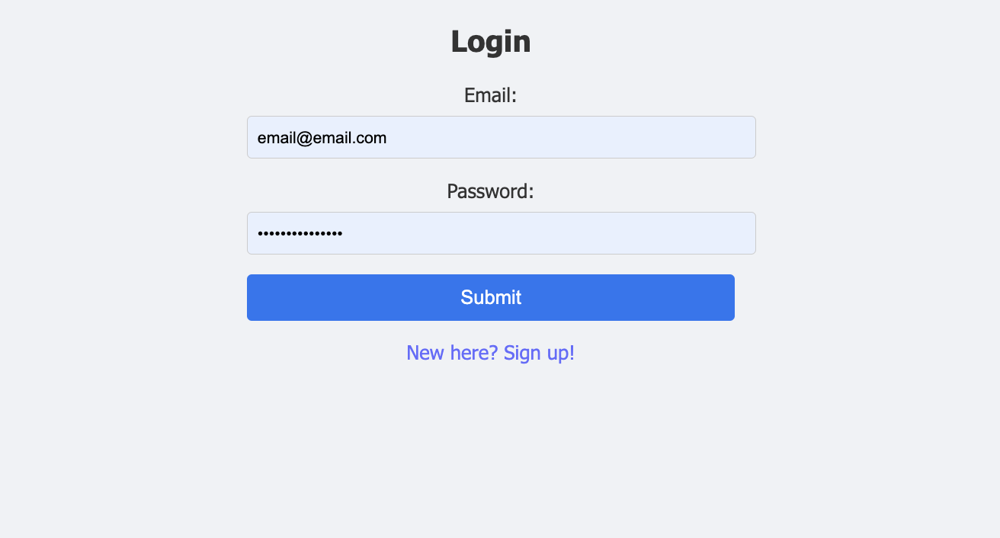
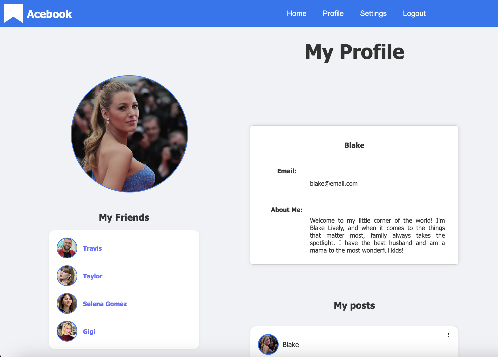

## Acebook 

Acebook is a full-featured social networking web application inspired by Facebook, built using the MERN stack (MongoDB, Express.js, React, Node.js). It aims to replicate core functionalities of Facebook, providing users with an intuitive platform for connecting and sharing with friends and family.

## Features 

- User Authentication (Sign Up, Log In, Log Out)
- Profile Customization (Profile Picture, name, email, about me)
- Posts (Create, Edit, Delete Posts)
- Comments & Like (CRUD)
- Friends System (Send Friend Requests, Accept/Reject Requests)
- Responsive Design for all devices
<!-- - Real-time Notifications -->


## Built With

- MongoDB - Database
- Express.js - Web Application Framework
- React - Frontend Library
- Node.js - JavaScript Runtime


## Authors (Team)

- Demetrius Vissarion - https://github.com/demetriusvissarion
- Thomas Mazzag - https://github.com/TomMazzag
- Gabriela Ehrenbrink - https://github.com/gabrielaehrenbrink/
- Jehoshua - https://github.com/AVJehoshua
- Fawaz Tarar - https://github.com/Fawaztarar

## Application

|   Description    |   Image    |
|:------------:|:----------------:|
|Landing Page| |
|Sign Up Page| |
|Login Page| |
|Profile Page| |
|Settings Page| |
|Posts Page| |
|Comment Post| |
|Like Comment| |


## Acknowledgments

This project wouldn't have been possible without the collective effort and dedication of our entire team. Each member brought unique skills and perspectives that enriched the development of Acebook, making it not just a project, but a learning journey for all of us

- Team Spirit: A huge shoutout to every team member for their unwavering commitment

- Collaborative Learning: Special thanks to everyone for creating an environment where learning from one another was not just encouraged but became a part of our daily routine. The shared knowledge has been invaluable.

- Problem-Solving: Kudos to the team for not shying away from challenges. Tackling each obstacle head-on and turning them into opportunities for growth has been inspiring

- Support and Encouragement: Gratitude to each team member for the support and motivation provided throughout the project. Whether it was debugging, design feedback, or just a word of encouragement, it made all the difference.

- Special Thanks to Claire Castanet (Technical Coach at Makers): Claire's insights and constructive feedback have not only helped us overcome numerous technical challenges but have also contributed significantly to our growth as developers.

## Contributing

<!-- Please read CONTRIBUTING.md for details on our code of conduct, and the process for submitting pull requests to us. -->


## Getting Started

These instructions will help you set up a copy of Acebook running on your local machine for development and testing purposes.

## Prerequisites

- Node.js
- MongoDB
- Git


### Important after adding a new module / Check after commits

Rerun 
```shell
npm install
``` 
after commits

### Structure

This repo contains two applications:

- A frontend React App
- A backend api server

These two applications will communicate through HTTP requests, and need to be
run separately.

### Documentation

[More documentation of the codebase and its architecture can be found here.](./DOCUMENTATION.md)
It's recommended you all read the suggested docs _after making sure the whole
setup below worked for everyone_. Then work together on a diagram describing how
the application works.

### Trello

https://trello.com/b/7rxgh5Ru/earthteamacebookmern

### Excalidraw
https://excalidraw.com/#room=e115eb6edcbdeb8825e3,kac4R5E5jjeYdOzmObmeXA

### Miro
https://miro.com/app/board/uXjVNznJ0RY=/

### Team Charter
https://docs.google.com/document/d/1jghTv3mIVKXAueXtq8aNkR4giNgNY8sVf-ct_ZhpC7U/edit

### Quickstart

### Install Node.js

If you haven't already, make sure you have node and NVM installed.

1. Install Node Version Manager (NVM)
   ```
   brew install nvm
   ```
   Then follow the instructions to update your `~/.bash_profile`.
2. Open a new terminal
3. Install the latest version of [Node.js](https://nodejs.org/en/), (`20.5.0` at
   time of writing).
   ```
   nvm install 20
   ```

### Set up your project


3. Developer can fork to their local machine
4. Install dependencies for both the `frontend` and `api` applications:
   ```
   cd frontend
   npm install
   cd ../api
   npm install
   ```
5. Install an ESLint plugin for your editor, for example
   [ESLint for VSCode](https://marketplace.visualstudio.com/items?itemName=dbaeumer.vscode-eslint)
6. Install MongoDB
   ```
   brew tap mongodb/brew
   brew install mongodb-community@6.0
   ```
   _Note:_ If you see a message that says
   `If you need to have mongodb-community@6.0 first in your PATH, run:`, follow
   the instruction. Restart your terminal after this.
7. Start MongoDB

   ```
   brew services start mongodb-community@6.0
   ```

### Setting up environment variables.

We need to create two `.env` files, one in the frontend and one in the api.

#### Frontend

Create a file `frontend/.env` with the following contents:

```
VITE_BACKEND_URL="http://localhost:3000"
```

#### Backend

Create a file `api/.env` with the following contents:

```
MONGODB_URL="mongodb://0.0.0.0/acebook"
NODE_ENV="development"
JWT_SECRET="secret"
```

For an explanation of these environment variables, see the documentation.

### How to run the server and use the app

1. Start the server application (in the `api` directory) in dev mode:

```
; cd api
; npm run dev
```

2. Start the front end application (in the `frontend` directory)

In a new terminal session...

```
; cd frontend
; npm run dev
```

You should now be able to open your browser and go to
`http://localhost:5173` .

Then, after signing up, you should be able to log in by going to
`http://localhost:5173/login`.

After logging in, you won't see much but you can create posts using PostMan and
they should then show up in the browser if you refresh the page.


# Guide for using Git/GitHub

## 1.  Add all your files, commit and push to your branch.

When in the branch you're working in, and you're happy with all your changes, use the following:
```shell
git add .
git commit -m "Your commit message"
git push
```

## 2. Checkout to main and pull any changes from main

Switch to the main branch and pull any changes from there:
```
git checkout main

git pull origin main
```


## 3. Checkout to your branch and merge it with the main branch

Switch to your branch and merge it with the main branch.
```shell
git checkout your-branch-name

git fetch
git merge origin/main
```


## 4. Retest all your code with the new changes from main

Once you've merged your branch with the main, open your virtual environment and retest all your code and also **checking the html pages are working appropriately**.

```

If there were changes, **repeat step 1** and do another pull to check there aren't any changes from main.


## 5. Push your final changes

Push your final changes when you're happy.

```shell
git push origin your-branch-name
```

Or if you're in your branch, just use
```shell
git push
```

## 6. Open up a pull request

If you've successfully completed **steps 1-5**, and would like your branch to be merged onto the main branch, open up a **pull request** and ask for your team to review it.

>[!CAUTION] 
>Make sure you do not just merge the changes FROM YOUR BRANCH to MAIN yourself! Ensure everyone has reviewed and approved your code first

If there are any issues with your code, make the appropriate changes and **repeat steps 1-5.**

>[!NOTE]
>If you have opened a pull request, any commits after that will be shown in that pull request so ensure your pull request is reviewed before you continue working on that branch.

If everything is approved and you merge your branch to the main branch, drop a message in the Slack channel to notify everyone to pull these changes.

## 7. How to revert to old commits when app breaks (locally)

Step 1.
To see all previous commits:
```shell
git logs
```
or
To see all previous commits from the current user:
```shell
git reflog
```

Step 2.
Reset the branch to last working version using the commit hash of the commit you want to revert to ( the one before the issues )
```shell
git reset --hard <commit_hash>
```